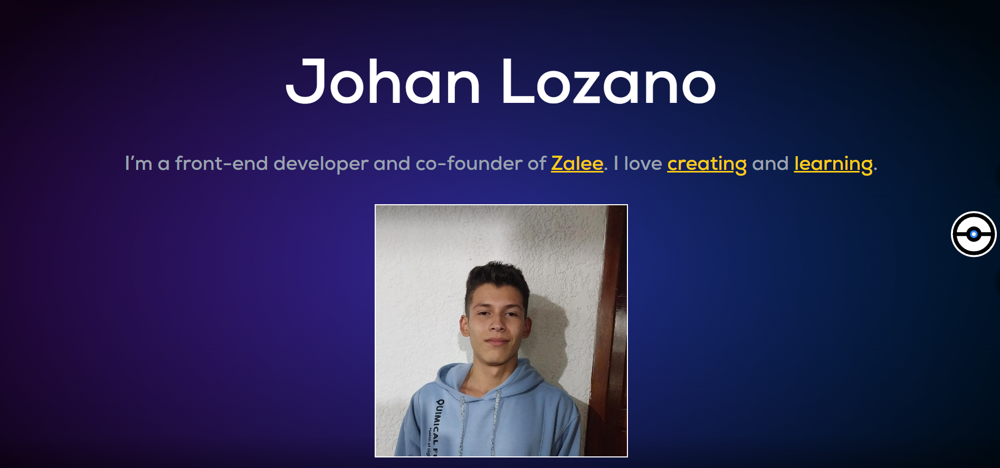

Índice

- [🤔 Por qué aprendería?](#-por-qué-aprendería)
- [👁️ Aprendizaje activo](#️-aprendizaje-activo)
  - [Astro](#astro)
  - [Tailwind](#tailwind)
  - [Resultado final](#resultado-final)
- [😐 Conclusión](#-conclusión)
- [❤️ What's next](#️-whats-next)

Si hay algo que me encanta, aparte de programar, es aprender, aprender nuevas tecnologías me hace sentir una persona menos ignorante y me anima a descubrir nuevas cosas que al final termino amando.

## 🤔 Por qué aprendería?

Hace unas semanas, bien aburrido, decidí ver un video de [@midudev](https://www.youtube.com/watch?v=RB5tR_nqUEw) donde se encuentra un curso de [Astro](https://astro.build), un framework web que no tenía ni idea que existía, sin embargo, al ver el curso quedé bastante interesado, sobre todo en su componentización y el hecho de ser agnóstico al framework.

Dado que me gustó la herramienta, quise comenzar a aprenderla, así que como proyecto para esto, decidí hacer mi propia "Landing Page", ya que Astro es muy usado para esto, por su naturaleza estática.

## 👁️ Aprendizaje activo

### Astro

Tengo que decir que la documentación de Astro es bastante buena, resultando en un aprendizaje más sencillo, ya que personalmente aprendo mejor leyendo. 

Lo importante aquí es ver, ya sea la documentación, un video, o lo que sea mejor para tí, a la par que lo haces tu mismo, si no lo haces por tu propia cuenta, probablemente lo ovidarás en unos minutos. 

Yo, en general, recomiedaría seguir los tutoriales que tienen para tí, como el [tutorial para hacer un blog](https://docs.astro.build/en/tutorial/0-introduction/) en el caso de Astro, pero aplica para los demás, por ejemplo, React con el [tutorial de Tic Tac Toe](https://es.react.dev/learn/tutorial-tic-tac-toe).

### Tailwind

Este es mucho más cencillo, ya que si sabes un poco de CSS, no hace falta ningún tutorial, solo buscar cual es la propiedad que quieres escribir y listo, es más dificil al inicio, pero unas horas después ya te amarras a el. Con que sepas que es, para que se usa y para que usarlo, estás listo para empezar a aplicarlo.

### Resultado final

Puedes verlo completo en [johanlozano.me](https://johanlozano.me)

## 😐 Conclusión

En base a lo descrito en mi experiencia, rescato los siguientes puntos.

1. **¿Qué es y para qué se usa?** Date la oportunidad de explorar nuevas tecnologías y ver por qué están cogiendo fuerza.
2. **¿Por qué lo aprendería?** Si realmete te pareció util o simplemente divertido, es una buena razón para empezar a aprenderlo.
3. **Encuentra de donde aprender.** Esto ya dependerá de si eres mejor viendo videos, cursos o leyendo tutoriales, en mi caso, considero que leer un texto es mucho más rápido que escucharlo.
4. **Activo.** Sigue lo que sea que estés siguiendo mientras lo haces tu mismo, si solo miras o escuchas, se te olvidará y no estás aplicando nada.
5. **Proyecto.** Idea un proyecto para demostrarte a ti mismo y todo el mundo que realmente aprendiste. Un proyecto que hagas sin tener que seguir un tutorial paso a paso.
6. **Celebra y date un abrazo a ti mismo 🥳.** Si te das una recompensa, lo verás como algo positivo y querrás repetirlo, date cuenta de lo mucho que progresaste y se amable contigo mismo.

## ❤️ What's next

Sigue este blog para ver el proceso de aprendizaje y creación de esta pag web desde cero 👁️.